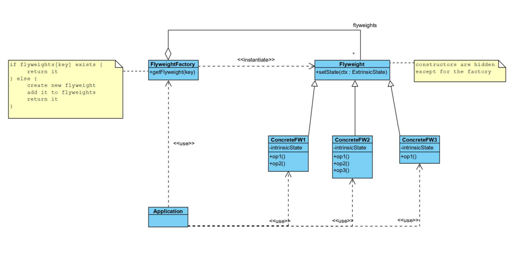
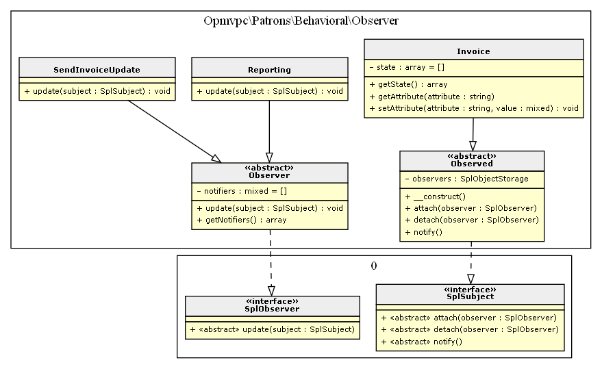
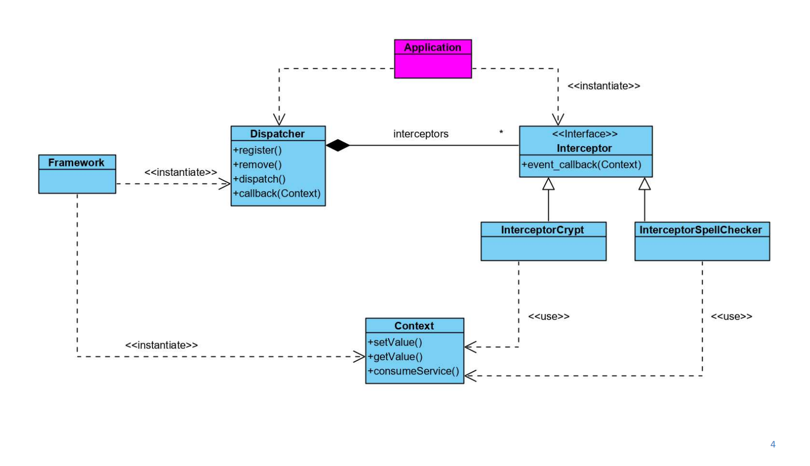
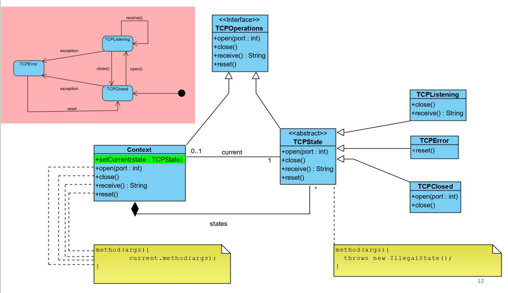
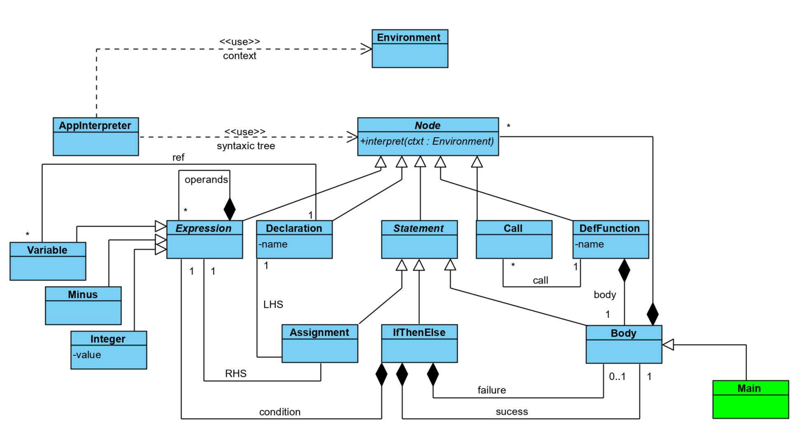
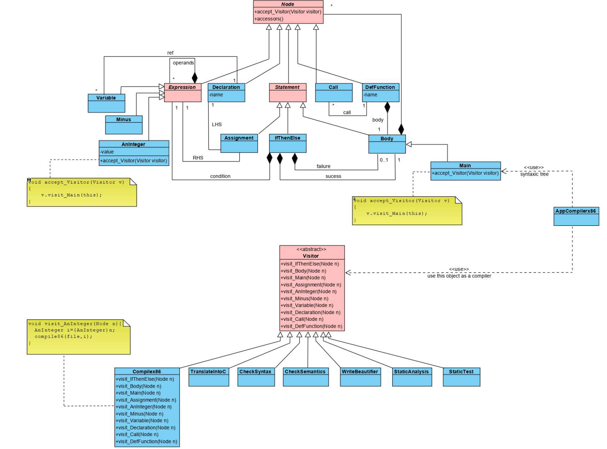
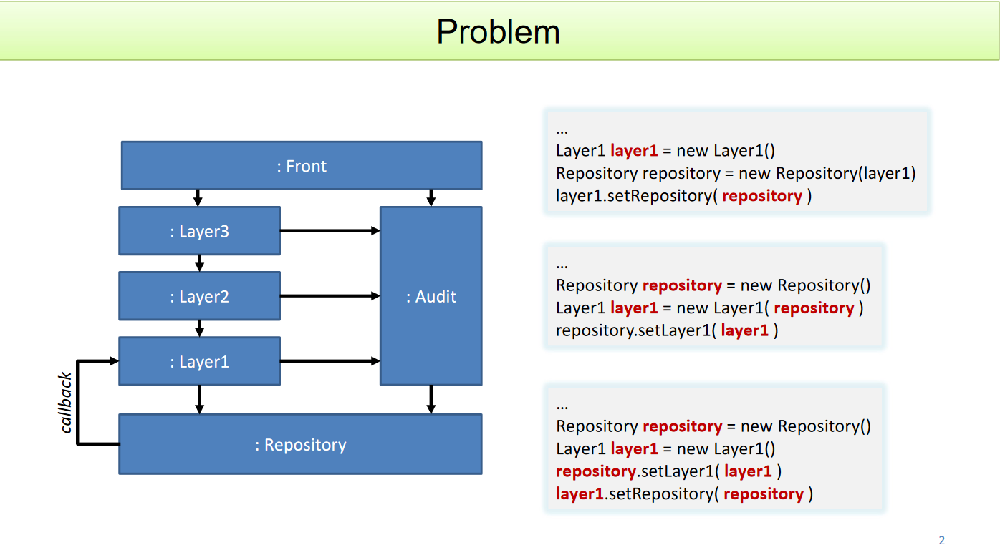
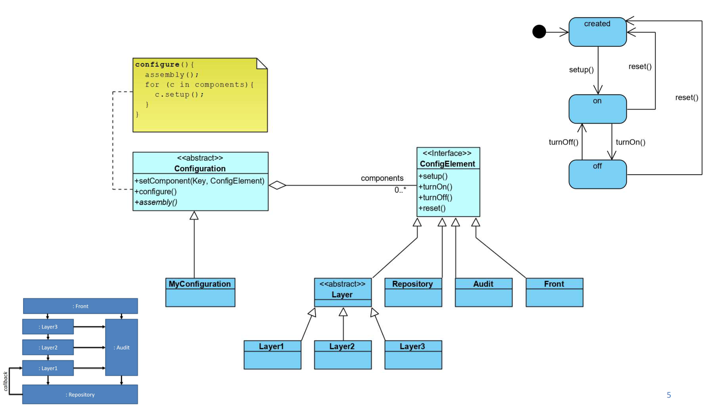

# Patrons de conception

[](https://packagist.org/packages/opmvpc/patrons)
[](https://packagist.org/packages/opmvpc/patrons)
[](https://github.com/opmvpc/patrons/actions?query=workflow%3Arun-tests+branch%3Amaster)


Exemples d'implémentation de patrons de conception en php.

Le package est écrit à l'aide de l'analyseur statique de code psalm. Le code utilise un maximum les nouvelles fonctionnalités de typages offertes par php 7.4. Le code est couvert par les tests à 100%.

Les différents diagrames de classe UML sont générés à partir du code. Le package utilisé ne représente pas les relations entre les classes.


The Gang of Four working on their next pattern idea.

## ⚙ Requirements
- php ^7.4
- composer

Pour générer les diagrames de classe UML:
- extension php imagick
- graphviz installé (+ var d'environnement PATH pour windows)

## 🛠 Installation

You can install the package via composer:

```bash
git clone
composer update
```

## 📚 Table des matières

Attention, le contenu est en construction!

**[Creational](#Creational)**
* [Singleton](#Singleton)
* [Abstract Factory](#Abstract-Factory)
* [Prototype](#Prototype)


**[Structural](#Structural)**
* [Proxy](#Proxy)
* [Decorator](#Decorator)
* [Composite](#Composite)
* [Facade](#Facade)
* [Bridge](#Bridge)
* [Flyweight](#Flyweight)
* [Adapter](#Adapter)


**[Behavioral](#Behavioral)**
* [Command](#Command)
* [Memento](#Memento)
* [Observer](#Observer)
* [Visitor](#Visitor)
* [Template](#Template)
* [State](#State)
* [Interceptor](#Interceptor)
* [Configuration](#Configuration)

**[Autres Patterns](#Autres-Patterns)**
* [Interpreter](#Interpreter)

**[Bibliographie](#Bibliographie)**

# Creational


## Singleton

Permet de forcer une classe à n'être instanciée qu'une seule fois. Pour mettre ce patron en oeuvre, on fait appel aux attributs statiques et mettant la visibilité private aux constructeurs.

En php on va faire en sorte que les méthodes magiques __construct(), __clone() et __wakeup() ne puissent pas être utilisées.


### Singleton classic
[code de Singleton.php](src/Creational/Singleton/Singleton.php)

*Problème:* la variable statique $instance est partagée pour toutes les classes qui étendent Singleton

### Singleton Générique

[code de SingletonGeneric.php](src/Creational/Singleton/SingletonGeneric.php)

*Problème:* En php, on a pas encore de types génériques. On peut utiliser Psalm pour les simuler avec la balise "@ template T" Malheureusement, elle ne fonctionne pas pour les attributs statiques.

*Solution:* On peut stocker les instances dans un tableau.

[https://blog.cotten.io/how-to-screw-up-singletons-in-php-3e8c83b63189](https://blog.cotten.io/how-to-screw-up-singletons-in-php-3e8c83b63189)

### Comment ajouter la fonctionnalité Singleton à une classe.
*Solution:* On peut utiliser la réflexion pour recréer des classes en leur ajoutant les fonctionnalités d'un singleton. Exemple de création d'une SingletonFactory.

[https://patrick-assoa-adou.medium.com/a-generic-php-singleton-the-long-of-it-661b1ead3981](https://patrick-assoa-adou.medium.com/a-generic-php-singleton-the-long-of-it-661b1ead3981)

*Solution:* Ou on passe par une fonction singletonize

[https://patrick-assoa-adou.medium.com/a-generic-php-singleton-1985f17eeb6f](https://patrick-assoa-adou.medium.com/a-generic-php-singleton-1985f17eeb6f)

*Remarque:* C'est sencé être mieux d'utiliser l'injection de dépendances que Singleton que certains considèrent comme un anti-pattern

### Utilisation du pattern dans des gros projets

Usages fréquents:
* DAO (accès db)
* un Logger
* lock file pour l'application

Exemple:
* Laravel ServiceContainer

### Utilisation du pattern pour un dictionnaire en plusieurs langues

[code de l'exemple du dictionnaire](src/Creational/Singleton/Dict)

On peut instancier plusieurs classes qui étendent DictSingleton. On viole les principes du patron Singleton de base.

*À quoi ça sert:* On est quand même certain que les différents dictiunaires ne seront instanciés qu'une fois et qu'on ne permet pas de modifier ces objets.

## Abstract Factory
Permet de créer des objets différents avec une API qui sera similaire.
Exemple ici avec Des usines à voitures thermiques et électriques.

[code du pattern AbstractFactory](src/Creational/Factory/AbstractFactory/)


Utilisation:
* Quand *plusieurs lignes de produits* à gérer
* Un reader de fichier différent en fonction de l'OS

## Prototype
Cloner des objets plutôt que de les créer par l'opération "new ObjectClass()". Se rélèle moins couteux et demande souvent moins de code quand on a besoin de plusieurs objets similaires. Attention, il faut implémenter la méthode clone pour faire des deepcopies.

Utilisations:

* Interface graphique de création de niveau de jeux video.
* logiciel CAD?

Exercice: Utiliser une classe abstraite qui utilise un array pour stocker les valeurs des attributs et fourni une méthode clone qui copie les attributs

Bonus php: On implémente l'interface ArrayAccess pour accéder au valeurs de la propriété `$attributes` d'un de nos objets avec la même notation que celle d'un tableau (Ex: `$floor['floorId]`)

[code du pattern Prototype](src/Creational/Prototype)


# Structural
## Proxy

Permet de cacher un objet couteux en ressources en ne manipulant qu'un objet proxy qui va s'occuper de créer et manipuler l'objet couteux pour nous.

[code du pattern Proxy](src/Structural/Proxy)


Utilisations:
* On doit controller l'accès à un objet
* On doit ajouter des fonctionnalités quand on accède à un objet.
* Droits d'accès
* Le proxy peut-être utilisé comme substitue d'un autre objet

Types de proxies:
* Protection proxy (controlle d'accès à une ressource)
* Virtual proxy (exemple du placeholder video)
* Remote proxy (objet local qui cache les appels à distance vers un serveur)

Sources:

[https://en.wikipedia.org/wiki/Proxy_pattern](https://en.wikipedia.org/wiki/Proxy_pattern)

[https://www.geeksforgeeks.org/proxy-design-pattern/](https://www.geeksforgeeks.org/proxy-design-pattern/)

## Decorator
Permet d'ajouter dynamiquement des fonctionnalités à un objet. Alternative à la création de sous-classes.

[code du pattern Decorator](src/Structural/Decorator)


### Comparaison Proxy et Decorator

Ils ont une structure proche. Ils utilisent tous deux une interface pour créer des objets aux méthodes compatibles et chainables.

Le but de pattern Proxy est "de représenter"/"être à la place" d'un autre objet, tandis que le but du pattern Decorator est d'ajouter des nouvelles fonctionnalités à des objets à l'exécution.

### Problème des ScrollDecorator et du 3DDecorator

L'effet 3D s'applique sur la fenetre mais pas sur les scrollbars.

Solution:
* On force une instance de classe à n'être référencée qu'une seule fois. (je suis pas certain d'avoir bien compris 😥)

[https://en.wikipedia.org/wiki/Decorator_pattern#Motivation](https://en.wikipedia.org/wiki/Decorator_pattern#Motivation)

## Composite
Exercice: Gestionnaire de fichiers avec le pattern Composite.
* création de fichiers et dossiers
* supprimer des fichiers et dossiers
* déplacer des fichiers et dossiers
* copier des fichiers et dossiers
* check si des fichiers et dossiers sont les même / ont la même structure
* check si deux fichiers ont la même structure

[code du pattern Composite](src/Structural/Composite)


Exercice: Gestionnaire de fichiers avec le pattern Composite.

Solution:
* Ajout d'une classe FileManager qui permet de simplifier l'api
* Quelques méthodes en plus (find($name), goTo($path))
* Attention, l'écriture sur disque n'est pas implémentée. Pour cela, il faudrait juste compléter certaines méthodes.

### Exercices
#### Comment utiliser le pattern Visitor avec le pattern Composite?
TODO
#### Comment utiliser le pattern PlayerRole avec le pattern Composite pour implémenter la transformation d'une feuille/container en component?
TODO

### Amélioration php
On pourrait utiliser les interface :
* (SplObjectStorage)[https://www.php.net/manual/fr/class.splobjectstorage.php] dans la classe Component pour stocker les enfants
* (RecursiveIterator)[https://www.php.net/manual/fr/class.recursiveiterator.php] Pour naviguer dans les enfants
* (SeekableIterator)[https://www.php.net/manual/fr/class.seekableiterator.php] Pour trouver des enfants (la logique est déjà écrite, il faudrait juste changer les noms de méthodes) ou naviguer dans l'arbre depuis la root dans le FileManager

## Facade

## Bridge
Permet de découpler l'implémentation d'une interface et de découpler notre code de l'interface.
On peut ainsi changer d'implémentation durant l'exécution.

Exemple: Système de réponse qui peut render de l'Html soit du Json en fonction de l'implémentation de renderer utilisée.

[code du pattern Bridge](src/Structural/Bridge)


### Exercices
#### Ajouter une implémentation TailwindCSS et observer l'impact sur l'architecture:
* Pas d'impacte notable. On doit juste créer une nouvelle classe qui implémente RendererImplementation
#### RendererImplementation est une interface. Comment on peut l'améliorer en utilisant une classe abstraite (voir pattern Template)
* Todo
#### Comment une Abstract Factory pourrait contribuer au pattern Bridge?
On pourrait utiliser les abstract factory pour choisir l'implémentation utilisée en fonction des besoins dans chaque factory.

## Flyweight
* Permet d'éviter d'avoir une grande quantité d'objets qui se ressemblent en mémoire
### Exemple
Traitement de texte pour lequel on peut appliquer différents styles à du texte.
On veut ici éviter d'avoir un objet pour chaque lettre par exemple.

### Comment?
On utilise une factory pour créer les objets Lettre. La factory créera un objet lettre s'il n'est pas encore instancié, sinon il utilisera une référence vers l'objet qui existe déjà.
Cela permet aux objets Lettre d'être aggnostiques aux contexte dans lesquels ils sont utilisés (et ainsi réutilisables dans plusieurs contextes différents).
Pour ce qui est du style de la lettre, on ira le stocker dans un objet conteneur (par exemple Mot)



## Adapter

# Behavioral

## Observer
Utilisations:
* Quand un changement sur un objet demande de changer d'autres objets
* Quand on doit pouvoir notifier d'autres objets sans que couplage avec ces objets (notification par broadcast)
* Permet de mettre à jour "réactivement" une classe sur base d'un évènement ou si les données d'une autre classe change
* Permet de découper une grosse classe en plusieurs classes qui seront observers de la classe factorisée.

[code du pattern Observer](src/Behavioral/Observer)



En php, on va utiliser les interfaces SplObserver et SplSubject (inclues dans le langage php) qui sont dédiées à l'implémentation du pattern Observer.

On va aussi utiliser la structure de données dédiée au stockage d'objets SplObjectStorage (inclue dans le langage php) pour enregistrer les observers dans la classe Observed.

### Exercices
#### Améliorer le pattern en évitant les updates inutiles (ex: les données n'ont pas changées)
* Ajout d'un check dans la méthode setAttribute() de la classe Observed
* on peut regarder quels sont les changements de state si on garde en mémoire l'état précédent dans les observers

#### Utiliser le pattern Observer avec le pattern State pour que la class soit consciente des transitions d'état de certains objets.
ex: objet x doit être notifié de chagque changement de l'état courant de l'objet y

TODO

## Interceptor
* Ajouter ou enlever des fonctionnalités pendant l'exécution (système de plugin)
* Modifier des fonctionnalités pendant l'exécution
* Déclancher des fonctionnalités de facon automatique (installation d'un plugin)


* + Extensibilité
* + Flexibilité
* + Séparation des préoccupations
* + Réutilisabilité
* - Effets de bord
* - Difficulté à gérer les envent rérentrant (ex: message tcp envoyé et recapté par le mécanisme ... boucle infinie)
* - difficulté d'antaciper les extensions futur du framework


## Template

## State
Permet d'abstraire une machine à état fini sous forme de classes.

* Utilisation d'une interface définissant les différentes transitions
* Implémentation de l'interface par une classe concrète qui utilisera d'autres objets pour effectuer des opérations (un peu comme pour le pattern Proxy)
* Une classe abstraite dont les méthodes renvoient des exceptions
* Cette classe abstraite est implémentée par une classe par État dans lesquels on override que les méthodes nécessaires (comme ca on renvoie automatiquement une execption si une transition n'est pas possible)
* La classe concrète possède un objet courrant (un état) sur lequel seront appelées les méthodes (transitions)

### Avantages:
* Structure efficacement le code
* rend les trasitions explicites


## Memento

## Command

## Interpreter
Permet de définir la sémantique opérationnelle d'un langage.
Pour cela, on va représenter notre arbre abstrait syntaxique avec un ensemble de classe qui concrétisent une classe abstraite Node.
La classe Node possède une méthode "interpret" qui défini la sémantique opérationnelle d'un élément de l'arbre abstrait syntaxique.
Cette méthode interpret modifie l'environnement d'exécution (context).
Ce pattern fonctionne mieux avec une grammaire simple et si l'éfficacité n'est pas un critère prépondérant. Si c'est le cas, on préfèrera créer un compilateur complet.


## Visitor
### But
* Permet de découpler les opérations sur une structure de données
* Découpler des taches qui ne sont pas liés les unes aux autres

### Comment?
Utiliser une classe abstraite Visitor qu'on pourra implémenter de plusieurs façon en fonction des traitements voulus (ex: X86Visitor, DocHtmlVisitor...)

### Avantages
* Ajout facile de nouvelles fonctionnalités
* Utiliser un accumulateur (ex: table des symboles). Sans le pattern l'accumulateur devrait être passé à toutes les méthodes soit utilisé en variable globale
### Désavantages
* Quand on ajoute un type de Node, on doit ajouter des méthodes pour le traiter dans chaques visiteur (sauf si on utilise des classes abstraites pour chaque visiteur avec des comportements par défaut comme ANTRL)
* On casse l'encapsulation (besoin de mettre en public toutes les méhtodes, l'utilisateur pourrait avoir besoin d'un peu tout)
* La traversée de l'AST est déterminée par le programme qu'il représente. On ne choisit pas la facon dont la traversée va se faire.



## Configuration
### But
* Réunir à un seul endroit le code de configuration des objets (ex: relations entre des objets)
* Préparer les objets pour qu'ils puissent coopérer
* Rendre explicite le cycle de vie de ces objets

### Avantages
* Cacher et factoriser la logique de la configuration des objets
* facilité la documentation
* possibilité d'observer la configuration
### Désavantages


## TODO
- [x] Découper en catégories (behavioral, creational, structural)
- [x] Méthodes clone et wakeup pour le pattern singleton
- [x] Générer les diagrammes de classe sur base du code
- [x] Faire une TOC
- [ ] Ajouter les patterns vus aux cours (+ tests, description, réponses questions et Diagramme de classe, maj TOC)
    - [x] Singleton
    - [x] Abstract Factory
    - [x] Proxy
    - [x] Decorator
    - [x] Composite
    - [x] Prototype
    - [x] Bridge
    - [ ] Observer
    - [ ] Intercepteur
    - [ ] Flyweight
    - [ ] State
    - [ ] Visitor
    - [ ] Template
    - [ ] Strategy
    - [ ] Configuration
    - [ ] Command
    - [ ] Facade
    - [ ] Memento
    - [ ] Playerrole
    - [ ] Interpreter

## Bibliographie

Design Patterns PHP (plein de paterns avec exemples de code et diagrammes de classe)

[https://designpatternsphp.readthedocs.io/en/latest/README.html](https://designpatternsphp.readthedocs.io/en/latest/README.html)

## Testing

``` bash
composer test
```

## Psalm (static analysis)

``` bash
composer psalm
```

## Génération diagrames de classe

``` bash
php generateUmlCD.php
```

## Changelog

Please see [CHANGELOG](CHANGELOG.md) for more information on what has changed recently.

## Contributing

Please see [CONTRIBUTING](.github/CONTRIBUTING.md) for details.

## Security Vulnerabilities

Please review [our security policy](../../security/policy) on how to report security vulnerabilities.

## Credits

- [opmvpc](https://github.com/:author_username)
- [All Contributors](../../contributors)

## License

The MIT License (MIT). Please see [License File](LICENSE.md) for more information.
